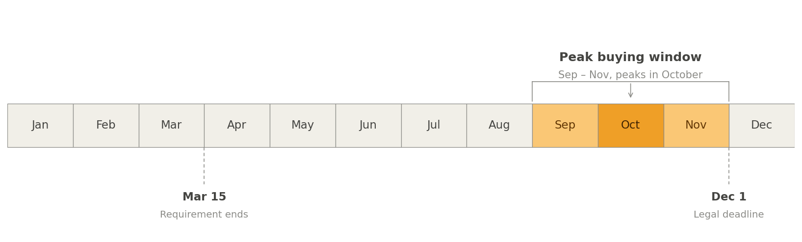
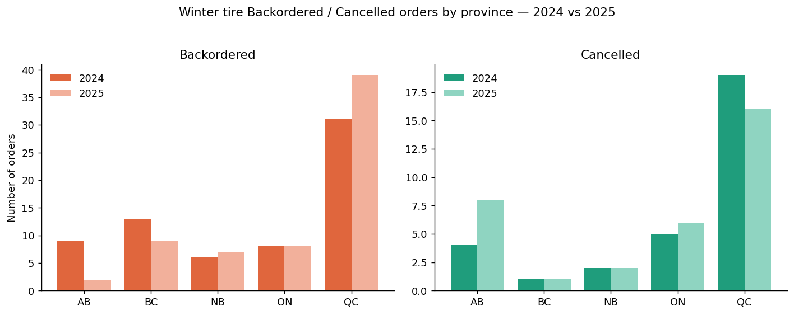
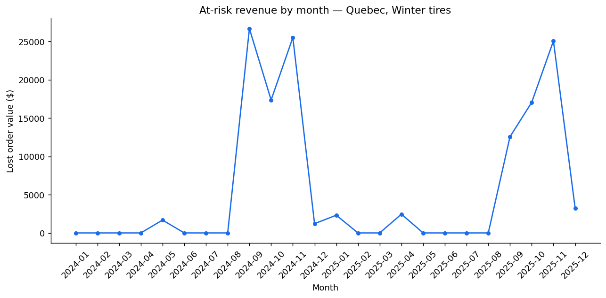
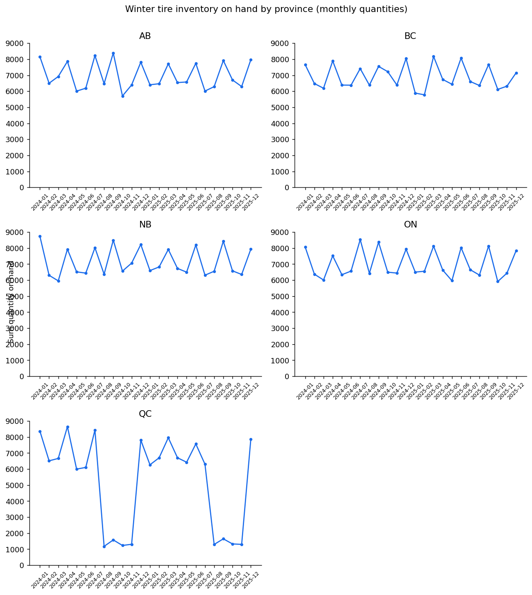

# The Quebec Winter Tire Problem

## Background and Overview
**Northline Tire Distribution**

Quebec sales reps reported losing garage customers ahead of the 2025 winter tire season, citing an inability to fulfill winter tire orders in time. This analysis confirms the complaint is accurate and quantifiable: Quebec's winter tire backorder rate is approximately 29%, four to seven times higher than every other region (4–8%). Unfulfilled winter tire demand in Quebec during the September–November peak represents approximately $124,169 in at-risk revenue across 738 short-shipped units and 87 affected orders — before accounting for any customers who left for a competitor rather than waiting on a backorder. The root cause is a severe seasonal inventory shortfall at the Montreal distribution centre, where winter tire stock on hand drops to roughly 1,200–1,300 units each August through November — the exact window when demand peaks ahead of Quebec's December 1 winter tire law — while every other region maintains stock in the 6,000–8,500 unit range through their equivalent season. This is a replenishment timing issue specific to Montreal, not a company-wide capacity constraint.

Quebec's Highway Safety Code requires winter tires on passenger vehicles from December 1 to March 15. In practice, most customers buy well ahead of that deadline — demand concentrates in September through November and peaks in October, months before the law actually takes effect.

## North Star Metrics

| Metric | What it tells us |
|---|---|
| **Backorder rate** | Share of orders that couldn't be fully filled — the clearest signal of whether the complaint is real |
| **Total orders** | Volume by region — needed to rule out "Quebec just orders more" as the explanation |
| **Inventory on hand** | Weekly warehouse stock — where the mechanism behind the problem actually shows up |
| **Lost order value (CAD)** | Unfulfilled quantity priced out — turns a rate into a number leadership can act on |

**Dimensions:** Region · Time (monthly, 2024–2025) · Category (Winter tires)

## Recommendation

a. **Move replenishment earlier** — Quebec's winter tire stock currently bottoms out around 1,200–1,300 units every August through November. Target keeping it above 6,000 units through that window instead, in line with what every other region already holds through its own peak season.

b. **Give Quebec a season-specific reorder point** — order volume in winter tires jumps roughly 4x from baseline in September; a flat, year-round reorder threshold can't react to that, which is exactly the gap that produced a 29% backorder rate against a 4–8% baseline everywhere else.

c. **Add a pre-season inventory check on August 1** — with enough lead time to close the gap before the 4-month shortfall window (Aug–Nov) starts, rather than reacting once backorders are already climbing.

d. **Track backorder rate and lost order value monthly, by region** — with $124,000 in lost order value across 87 orders in one region over one season, this is worth a standing metric, not a once-a-year discovery.

## Evidence

### Confirming the complaint

The first question wasn't "why" — it was "is this even real." Looking at winter tire orders specifically (rather than every order, which would have hidden the effect), one region stood out immediately.

Quebec wasn't just the worst region — it wasn't close. Once turned into a rate rather than a raw count, the gap holds up cleanly:

| Province | Winter Backordered | Winter Orders (Total) | Backorder Rate |
|---|---|---|---|
| AB | 11 | 255 | 4.3% |
| BC | 22 | 272 | 8.1% |
| NB | 13 | 228 | 5.7% |
| ON | 16 | 258 | 6.2% |
| QC | **70** | **242** | **29.0%** |

Two simpler explanations were checked and ruled out before going any further:

- **Was Quebec just busier overall?** No — total order volume across every region ran roughly even, so the gap wasn't a byproduct of Quebec generating more orders.
- **Do warehouses dip before every region's own busy season?** A little, yes — but nowhere close to Quebec's collapse. Every other region held steady through its own peak; Quebec was the only one that fell off a cliff.

The gap was specific to fulfillment, not demand, and specific to Quebec, not a company-wide pattern.

### Putting a number on it

A backorder rate tells you something is wrong. It doesn't tell leadership what it's costing. Pricing out every unfulfilled tire during the September–November buying window turned the pattern into a dollar figure — and showed it wasn't a one-time blip.

The same spike, almost to the month, in both years: roughly **$124,000 CAD in lost order value**, spread across 87 orders — and that's a floor, not a ceiling, since it only counts orders that were placed and partly unfulfilled. It doesn't count the customers who never placed an order at all because they went straight to a competitor.

### Finding out why

A pattern that specific, that consistent, pointed to something structural rather than bad luck. Comparing warehouse inventory across every region, month by month, showed exactly where it was coming from.

Four regions held steady stock year-round. Quebec's warehouse collapsed to a fraction of normal levels for four straight months — August through November — right as demand peaked. By the time stock recovered, the season causing the rush was already over.
